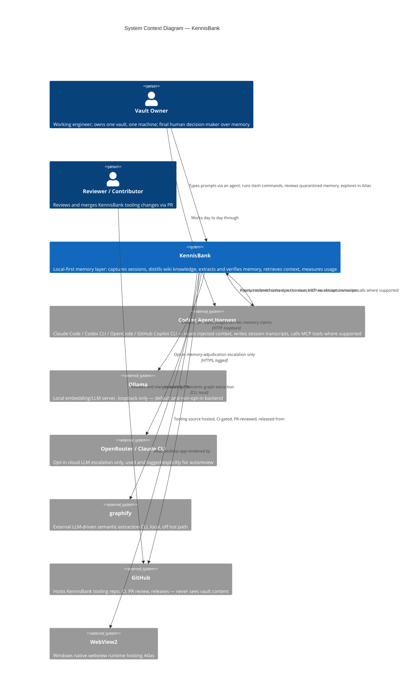

# C4 Context Level: KennisBank System Context

## System Overview

### Short Description

KennisBank is a local-first memory layer that turns AI coding-agent sessions into a durable, sourced knowledge base the same agents can retrieve from later — with a human staying editor-in-chief over what the system remembers.

### Long Description

Working with AI coding agents (Claude Code, Codex CLI, OpenCode, GitHub Copilot CLI) produces a steady stream of valuable context inside every session: decisions, fixes, dead ends, architecture trade-offs, preferences. That context normally evaporates the moment the session ends — the next session starts cold, and the same mistakes, the same questions, and the same explanations happen again.

KennisBank closes that loop on the user's own machine. It captures raw session transcripts, distils them into a sourced markdown wiki, extracts time-aware memory fragments, judges and verifies those fragments before trusting them, and retrieves the right slice of accumulated knowledge into a new session's context — inside a roughly two-second, fail-open budget so it never gets in the way of real work. A background usage-feedback loop measures whether injected knowledge was actually used, so the system's own retrieval quality improves over time rather than degrading into noise.

The problems it solves: (1) knowledge loss between agent sessions, (2) agents repeating debugged mistakes because nothing durable recorded the lesson, (3) the alternative of a hosted/cloud memory vendor, which this system deliberately avoids — plain markdown, local SQLite, local Ollama by default, nothing leaves the machine without explicit, logged, opt-in consent. Because the vault is plain markdown with YAML frontmatter under Git, it also works as an ordinary Obsidian vault with no lock-in: open it and it is just well-organized notes that happen to also power an AI memory.

Two extremes are explicitly out of scope: this is not a multi-user enterprise knowledge platform (there is no auth, no tenancy, no server to log into — everything is single-machine, single-vault), and it is not an autonomous memory system that acts on its own judgment — every escalation path terminates in a human decision (approve/reject in Atlas or `/kennisbank:review`), not an automatic write.

## Personas

### Vault Owner (Human User)

- **Type**: Human User
- **Description**: A working engineer — coder, writer, or both — who owns one KennisBank vault on their own machine and uses one or more AI coding agents day to day. This is the system's only human persona; there is no separate "admin" or "viewer" role because the vault has exactly one owner and no shared/multi-tenant deployment.
- **Goals**: Get relevant past context surfaced automatically without asking for it; keep the wiki accurate and free of stale or contradictory claims; retain final say over what the system treats as verified knowledge; avoid babysitting the pipeline — automation should require approval only where only a human can decide.
- **Key Features Used**: Session distillation (`/wiki`, `/destilleer`), memory review and quarantine triage (`/kennisbank:review`, Atlas), Atlas desktop exploration, vault install/upgrade (`setup.sh`, `/kennisbank-upgrade`), conflict/staleness checks (`/reconcile`, `/stale`), temporal recall (`/watdeedik`, `/weeklog`, `/timeline`).

### Coding Agent (Programmatic User)

- **Type**: Programmatic User
- **Description**: The AI coding agent itself — Claude Code, Codex CLI, OpenCode, or GitHub Copilot CLI — acting on the vault owner's behalf during a live session. It is both a consumer and a producer: it reads injected context at prompt time and, via the same session, is the source from which transcripts get captured and later distilled. Claude Code reaches KennisBank exclusively through lifecycle hooks; the other three also connect over MCP.
- **Goals**: Receive the most relevant prior context for the current prompt within the hot-path budget, without ever blocking or erroring the user's actual request (fail-open is a hard contract); optionally call recall/capture/review tools directly via MCP when the harness supports it.
- **Key Features Used**: Hot-path context injection (`kb-retrieve.py` at `UserPromptSubmit`), session-start/session-end lifecycle hooks, MCP tools (`recall`, `capture`, `review_pending`, `review_decide`, four temporal tools) where MCP is supported.

### Reviewer / Contributor (Human User)

- **Type**: Human User
- **Description**: A person — typically the vault owner in a different hat, or an external contributor — who reviews and merges changes to the KennisBank tooling itself (scripts, hooks, Atlas, docs) via pull requests, and who reads the automated GitHub Copilot PR review before merging. This is a role on the tooling repository, not on any individual vault's content.
- **Goals**: Ship tooling changes safely; catch drift between what a guard claims to cover and what it actually covers; keep the release process honest (verify a merge landed on `origin/main` before tagging).
- **Key Features Used**: PR review workflow (`/code-review`, `kennisbank-release`, `kennisbank-contribute` skills), CI gates, ADR governance (`adr-kit`).

### GitHub (External System, Programmatic)

- **Type**: External System
- **Description**: Hosts the KennisBank tooling repository, runs CI, posts the automated Copilot code review on pull requests, and hosts tagged releases. It plays no role in any individual vault's content — vault markdown is the user's own Git history, not GitHub-hosted by this system's design.
- **Goals (from the system's perspective)**: Gate tooling changes with tests and review before they reach any deployed vault.
- **Key Features Used**: CI workflow runs, PR review, release tagging.

## System Features

### Hot-Path Context Retrieval

- **Description**: On every prompt, embeds the query, searches the local hybrid vector+FTS index, widens with graph neighbors, reranks by trust/recency/usage signals, fits a token budget, and injects context — inside ~2 seconds, fail-open on any error so a slow or broken retrieval never blocks the actual prompt.
- **Users**: Coding Agent (primary), Vault Owner (indirect beneficiary)
- **User Journey**: [Agent Recalls Context at Session Start](#journey-agent-recall)

### Session Capture and Distillation

- **Description**: Captures raw session transcripts verbatim (capture-before-analysis), then on demand or at session end distils them into curated wiki articles and time-aware memory fragments, each carrying provenance back to the source session.
- **Users**: Vault Owner, Coding Agent (as the source of the transcript)
- **User Journey**: [Owner Distills a Session into Wiki Knowledge](#journey-distill)

### Memory Lifecycle and Trust Escalation

- **Description**: Extracted memory claims move through a state machine (unverified → current/quarantined → superseded/retracted/expired) via three escalating trust traps: grounded local verification, subagent adjudication, and — only when those are insufficient — human review. Nothing becomes "current" knowledge without clearing at least one trust gate.
- **Users**: Coding Agent (extraction source), Vault Owner (final human gate)
- **User Journey**: [Owner Reviews Quarantined Memory](#journey-review)

### Visual Vault Exploration (Atlas)

- **Description**: A read-only desktop application (one guarded write path: approve/reject a memory) giving the vault owner a visual window over vault health, the knowledge graph, memory lifecycle state, and the live retrieval waterfall.
- **Users**: Vault Owner only
- **User Journey**: [Owner Explores the Vault in Atlas](#journey-atlas)

### Temporal and Activity Recall

- **Description**: Answers "what happened, and when" from a bi-temporal event log derived from existing vault evidence — session logs, wiki writes, memory changes — via CLI, MCP, and slash commands alike.
- **Users**: Vault Owner, Coding Agent (via MCP temporal tools)
- **User Journey**: covered within the Atlas and MCP-integration journeys below; also reachable directly via `/watdeedik`, `/timeline`, `/weeklog`.

### Agent Harness Installation and Upgrade

- **Description**: One `setup.sh` flow installs and idempotently upgrades KennisBank's hooks and MCP registration into up to four independent agent harnesses (Claude Code, Codex CLI, OpenCode, GitHub Copilot CLI) against one vault, verified by a real MCP handshake, not just a config file.
- **Users**: Vault Owner (runs it), Coding Agent (is what gets registered)
- **User Journey**: [Owner Installs/Upgrades KennisBank into a New Harness](#journey-install)

### Programmatic MCP Integration

- **Description**: For harnesses that speak MCP (Codex CLI, OpenCode, GitHub Copilot CLI — not Claude Code, which uses hooks only), KennisBank exposes its recall/capture/review/temporal surface as MCP tools over stdio, so any MCP-aware agent gets the same functionality without bespoke per-harness code.
- **Users**: Coding Agent
- **User Journey**: [Agent Harness Connects over MCP](#journey-mcp)

## User Journeys

### Hot-Path Context Retrieval — Coding Agent Journey

1. Vault owner types a prompt into Claude Code, Codex CLI, OpenCode, or Copilot CLI.
2. The harness fires its prompt-submit lifecycle hook (or, for MCP-capable harnesses, the agent may call the `recall` MCP tool directly).
3. KennisBank's hook script embeds the prompt via local Ollama.
4. It searches the hybrid vector+FTS index (`kb-index.db`) and widens with graph neighbors (`kb-graph.db`).
5. Results are reranked by trust, recency, and past-usage signals, then trimmed to a token budget.
6. Context is injected back into the harness within the ~2-second budget; on any error, nothing is injected and the prompt proceeds unmodified (fail-open).
7. The agent answers using the injected context alongside its own reasoning.
8. A background usage-feedback pass later records whether the injected context was actually used or was noise, feeding future rerank quality.

### Session Capture and Distillation — Vault Owner Journey

1. A work session happens in an agent harness; the raw transcript is captured verbatim at session end (capture-before-analysis) into the vault's archive.
2. The vault owner runs `/sessielog` or `/wiki` (on demand, or triggered by session-end/staleness checks).
3. KennisBank distils the raw session into structured wiki articles and time-aware memory fragments, each tagged with provenance back to the source transcript.
4. `kb-lint.py` enforces the provenance and self-source rules before anything is accepted as a wiki write.
5. `safe-edit.py` performs the write as an atomic, Git-backed commit — every wiki change is a real commit, rollback-capable.
6. Downstream index builders (vector/FTS, graph, activity) pick up the new content off the hot path so the next retrieval sees it.

### Memory Lifecycle Review — Vault Owner Journey

1. A memory fragment is extracted from a session and enters the lifecycle as `unverified`.
2. Local grounded verification (`_groundcheck.py`, Ollama-backed) attempts to confirm the claim against existing evidence.
3. If grounded verification cannot decide, subagent adjudication runs a second, independent judgment pass (optionally escalating to a cloud LLM only if the vault owner has explicitly opted in via `auto_review_llm`; this call is logged, never silent).
4. If the claim still cannot be resolved automatically, it is quarantined and surfaces for human review.
5. The vault owner runs `/kennisbank:review` (or opens Atlas's memory-health lens) to see what has been decided or is pending.
6. The owner approves, rejects, or leaves a memory pending; only a human decision moves a quarantined claim to `current` or `retracted`.
7. Approved memories are upserted into `kb-index.db` and become retrievable on the hot path; nothing skips this gate.

### Visual Vault Exploration — Vault Owner Journey

1. The vault owner launches the installed Atlas desktop application.
2. The Tauri shell spawns the frozen FastAPI sidecar as a child process, bound to `127.0.0.1` only.
3. The frontend polls `GET /health` with backoff to tolerate cold-boot, then loads.
4. The owner browses one of Atlas's lenses: knowledge graph, vault overview, memory health, provenance, live retrieval waterfall, timeline, or per-document view — all backed by read-only SQL (`?mode=ro`) or file reads over the same stores the CLI/MCP path uses, reusing the vault's own production Python modules in-process for parity.
5. If a memory is quarantined, the owner can approve or reject it directly in the memory-health lens — the one guarded write path in Atlas (`POST /memory/decide`).
6. Atlas calls local Ollama only for a liveness probe and live recall-query embedding when the owner runs a recall query inside the app — the only outbound network call anywhere in Atlas, and it stays on loopback.
7. Closing the window kills the sidecar child process; no orphan process, no data left resident anywhere but the vault itself.

### Agent Harness Installation/Upgrade — Vault Owner Journey

1. The vault owner picks a vault path and runs `setup.sh` with `KENNISBANK_VAULT` set, selecting one or more harnesses (`--agents claude,codex,copilot`, etc.).
2. `install-agent-envs.py` writes hook registrations (Claude Code), MCP config (Codex `config.toml`, OpenCode `opencode.json`), and Copilot's adapter config, all pointing at the same vault and the same MCP server command.
3. For MCP-capable harnesses, `install-agent-envs.py:validate_mcp_runtime` performs a real MCP handshake and confirms every expected tool name is present — a config file naming the server is not accepted as proof of a working install.
4. `doctor.sh` runs a read-only post-install health check.
5. The owner restarts the harness and uses `/sessiestart` (or the Codex/Copilot equivalents) to confirm the session-start coordinator runs cleanly.
6. On a later `/kennisbank-upgrade`, the same flow re-runs idempotently: it replaces only legacy KennisBank hook entries, preserves unrelated user hooks, and re-validates the MCP handshake before declaring success.

### Agent Harness Connects over MCP — Programmatic Journey

1. Codex CLI, OpenCode, or GitHub Copilot CLI starts an agent session and, per its installed config, spawns `kb-mcp.py` as a child process speaking MCP over stdio (Claude Code does not do this — it uses hooks exclusively).
2. The harness calls `initialize()` then `list_tools()`; KennisBank returns its full tool surface: `recall`, `capture`, `review_pending`, `review_decide`, plus four temporal tools (`what_did_i_do`, `timeline`, `weeklog`, `topic_timeline`).
3. During the session, the agent calls `call_tool("recall", …)` to pull context on demand, or `call_tool("capture", …)` to record something worth remembering, in addition to whatever the harness's own lifecycle hooks already inject.
4. `kb-mcp.py` dispatches into the same library modules the hook scripts use (`_kbindex.py`, `_embeddings.py`, `_memory.py`, `_activity.py`) — it is a thin protocol wrapper, not a second implementation.
5. Reads and writes go to the same `kb-index.db` / `kb-activity.db` stores as every other path; `capture` and `review_decide` are the two MCP calls that write.
6. The harness owns the process's lifetime — it is killed when the agent session ends. No health check beyond the MCP handshake itself; no port, no persistence beyond that session.

## External Systems and Dependencies

### Ollama (local, default)

- **Type**: Local LLM/embedding server (external process, not part of this repository)
- **Description**: Runs on the user's own machine at `http://127.0.0.1:11434`, serving both embedding models (default `qwen3-embedding:8b`, per ADR-0001) and small local LLMs used for memory judging/verification/reconciliation.
- **Integration Type**: HTTP, loopback only — never a network call leaving the machine.
- **Purpose**: The default and only non-opt-in inference backend, consistent with the CLAUDE.md constraint "Lokaal, altijd" (local, always). Four independent containers (hot-path scripts, MCP server, background workers, Atlas sidecar) share the same Ollama instance and the same GPU VRAM budget with no isolation between them — a real, currently unmitigated resource-contention risk documented at the container level, not a solved problem.

### OpenRouter / Claude CLI (cloud, explicitly opt-in)

- **Type**: External cloud LLM API
- **Description**: The sole cloud LLM path anywhere in the system, used only for the `/kennisbank:autoreview` client-LLM escalation trap when a memory claim cannot be resolved locally.
- **Integration Type**: HTTPS.
- **Purpose**: Optional additional judgment quality for hard-to-resolve memory claims. Used only if the vault owner has explicitly turned on the `auto_review_llm` setting; every call is logged, never silent. No hot-path or default-path component calls it. This is the one place private vault content can reach a third party, and only by explicit, visible consent.

### GitHub (Copilot CLI as harness; GitHub the platform for tooling distribution)

- **Type**: Two related but distinct external dependencies:
  1. **GitHub Copilot CLI** — an agent harness with its own live cloud dependency (ADR-0003), used the same way as any other coding agent to reach KennisBank via hooks/MCP.
  2. **GitHub the platform** — hosts the KennisBank tooling repository, runs CI (GitHub Actions), posts the automated Copilot PR review, and hosts release tags.
- **Integration Type**: (1) Cloud-backed CLI, own network path, out of KennisBank's control; (2) Git/HTTPS for the repository, CI runners, and releases.
- **Purpose**: (1) Lets Copilot CLI users get the same retrieval/capture functionality as any other harness — KennisBank's own retrieval stays local even though Copilot itself is cloud-backed. (2) Governs and distributes the tooling itself. **Neither path carries vault content** — GitHub never sees the user's markdown vault, memory fragments, or session transcripts; it only sees the KennisBank tooling source code when a contributor opens a PR.

### graphify (external CLI tool, local)

- **Type**: External LLM-driven semantic extraction tool
- **Description**: Produces `graphify-out/graph.json` from vault content via LLM-driven extraction; KennisBank's own deterministic graph scripts only repair, prune, and index that output — they never re-derive the semantic extraction themselves.
- **Integration Type**: CLI invocation, local, off hot path (background workers only).
- **Purpose**: Supplies the raw semantic link data that the deterministic knowledge-graph pipeline turns into fast weighted-neighbor lookups for retrieval widening and `/brug`.

### WebView2 (Windows, OS-native)

- **Type**: OS-native rendering runtime
- **Description**: Hosts the Atlas frontend on Windows; assumed pre-installed on Windows 11. macOS (WKWebView) is scaffolded but not implemented.
- **Integration Type**: OS-native embedding, no network.
- **Purpose**: Renders Atlas's TypeScript SPA inside the Tauri shell.

### Git (local, vault-adjacent)

- **Type**: Local version control
- **Description**: Every wiki write is a real Git commit via `safe-edit.py`'s atomic write path, giving the vault owner rollback-capable history over their own knowledge base.
- **Integration Type**: Local CLI (`git add`/`git commit`/`git reset`), no network requirement — the vault's own Git remote, if any, is entirely the user's choice and outside this system's scope.
- **Purpose**: Atomicity and history for wiki writes; not a distribution or backup mechanism this system manages.

## System Context Diagram

## Related Documentation

- [Container Documentation](./c4-container.md)
- [Component Documentation](./c4-component.md)
- [Code-Level Documentation and ADR Synthesis](./c4-code-docs.md)
